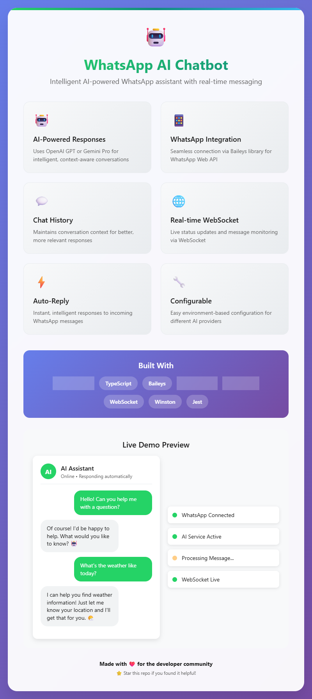

# 🤖 WhatsApp AI Chatbot

<div align="center">
  
  
  
  
  
</div>

<div align="center">
  
  
  ### 🚀 **Intelligent WhatsApp AI Assistant**
  
  *Powered by Gemini & OpenAI • Real-time Messaging • Context-Aware Responses*
</div>

---

A sophisticated WhatsApp AI chatbot built with Node.js, TypeScript, and OpenAI or Gemini (Google AI). This chatbot automatically responds to WhatsApp messages using AI-powered conversations with context awareness and real-time WebSocket communication.

## ✨ Features

- **🤖 AI-Powered Responses**: Uses OpenAI GPT or Gemini Pro for intelligent conversations
- **📱 WhatsApp Integration**: Connects via Baileys library for WhatsApp Web
- **💬 Chat History Management**: Maintains conversation context for better responses
- **🌐 Real-time WebSocket**: Live status updates and message monitoring
- **⚡ Auto-Reply**: Instant responses to incoming messages
- **🧭 Deterministic SHARH Funnel**: Application-owned buyer and seller stages, required fields, and next actions
- **🌍 Multilingual Qualification**: English, Russian, and Arabic conversation and field normalization
- **🤝 Reliable Manager Handoff**: Retryable delivery, manager summaries, and bot suppression after ownership transfer
- **🎭 Controlled Role Switching**: Support/sales switching is disabled for clients by default and can be limited to operators
- **📄 Google Sheets Lead Sync**: Writes structured funnel snapshots as an optional reporting export
- **🔧 Configurable**: Easy environment-based configuration
- **📊 Logging**: Comprehensive logging with Winston
- **🧪 Testing**: Jest testing framework included
- **🎯 TypeScript**: Full type safety and modern development experience
- **🔄 Provider Switch**: Easily switch between OpenAI and Gemini as your AI backend

## 🚀 Quick Start

### Prerequisites

- Node.js 18++
- npm or yarn
- OpenAI or Gemini API key
- WhatsApp account

### Installation

1. **Clone the repository**
   ```bash
   git clone <your-repo-url>
   cd whatsapp-ai-chatbot
   ```

2. **Install dependencies**
   ```bash
   npm install
   ```

3. **Configure environment**
   ```bash
   cp env.example .env
   ```
   
   Edit `.env` file with your configuration:
   - For **OpenAI**:
     ```env
     AI_PROVIDER=openai
     OPENAI_API_KEY=your_openai_api_key_here
     OPENAI_MODEL=gpt-3.5-turbo
     ```
   - For **Gemini**:
     ```env
     AI_PROVIDER=gemini
     GEMINI_API_KEY=your_gemini_api_key_here
     GEMINI_MODEL=gemini-pro
     ```
   - Other settings (shared):
     ```env
     PORT=3000
     MAX_HISTORY_LENGTH=50
     RESPONSE_DELAY=1000
     LOG_LEVEL=info
     AI_MAX_TOKENS=150
     AI_TEMPERATURE=0.7
     ```

4. **Build the project**
   ```bash
   npm run build
   ```

5. **Start the chatbot**
   ```bash
   npm start
   ```

6. **Scan QR Code**
   - A QR code will appear in the terminal
   - Scan it with your WhatsApp mobile app
   - The bot will be ready to respond!

## 🛠️ Development

### Available Scripts

```bash
# Development
npm run dev          # Start with hot reload
npm run build        # Build for production
npm start           # Start production build

# Code Quality
npm run lint        # Run ESLint
npm run lint:fix    # Fix linting issues
npm run format      # Format code with Prettier

# Testing
npm test            # Run tests
npm run test:watch  # Run tests in watch mode

# Utilities
npm run clean       # Clean build directory
```

### Project Structure

```
src/
├── config/         # Configuration management
├── services/       # Core services
│   ├── ai.service.ts           # OpenAI/Gemini integration
│   ├── whatsapp.service.ts     # WhatsApp connection
│   ├── chat-history.service.ts # Message history
│   ├── websocket.service.ts    # Real-time communication
│   ├── lead-capture.service.ts # Deterministic SHARH funnel and qualification state
│   ├── handoff.service.ts      # Retryable manager handoff delivery
│   ├── google-sheets.service.ts# Optional lead snapshot export
│   └── chatbot.service.ts      # Main orchestrator and ownership enforcement
├── types/          # TypeScript type definitions
├── utils/          # Utilities (logging, etc.)
└── index.ts        # Application entry point
```

## ⚙️ Configuration

### Environment Variables

| Variable         | Description                        | Default           |
|------------------|------------------------------------|-------------------|
| `AI_PROVIDER`    | AI provider: `openai` or `gemini`  | `openai`          |
| `OPENAI_API_KEY` | OpenAI API key                     | *(required for OpenAI)* |
| `OPENAI_MODEL`   | OpenAI model to use                | `gpt-3.5-turbo`   |
| `GEMINI_API_KEY` | Gemini API key                     | *(required for Gemini)* |
| `GEMINI_MODEL`   | Gemini model to use                | `gemini-pro`      |
| `PORT`           | WebSocket server port              | `3000`            |
| `MAX_HISTORY_LENGTH` | Max messages in chat history    | `50`              |
| `RESPONSE_DELAY` | Delay before sending response (ms) | `1000`            |
| `LOG_LEVEL`      | Logging level                      | `info`            |
| `AI_MAX_TOKENS`  | Max tokens for AI response         | `150`             |
| `AI_TEMPERATURE` | AI response creativity (0-2)       | `0.7`             |
| `GOOGLE_SHEETS_ENABLED` | Enable Google Sheets sync (`true`/`false`) | `false` |
| `GOOGLE_SHEETS_SPREADSHEET_ID` | Target spreadsheet ID | *(required when enabled)* |
| `GOOGLE_SHEETS_SHEET_NAME` | Worksheet name for lead rows | `Leads` |
| `GOOGLE_SHEETS_CREDENTIALS_JSON` | Service account JSON string | *(optional)* |
| `GOOGLE_SHEETS_CREDENTIALS_PATH` | Path to service account JSON file | *(optional)* |

### Google Sheets Setup

1. Create a Google Cloud service account and enable Google Sheets API.
2. Download the service account JSON key.
3. Share the target spreadsheet with the service account email (`client_email`) as Editor.
4. Configure one credentials option in `.env`:

```env
GOOGLE_SHEETS_ENABLED=true
GOOGLE_SHEETS_SPREADSHEET_ID=your_spreadsheet_id_here
GOOGLE_SHEETS_SHEET_NAME=Leads

# Option A: inline JSON
GOOGLE_SHEETS_CREDENTIALS_JSON={"type":"service_account",...}

# Option B: path to JSON key file
GOOGLE_SHEETS_CREDENTIALS_PATH=./service-account.json
```

When enabled, the bot writes structured sales lead snapshots whenever key data is captured or lead status changes. Google Sheets is an optional reporting export, not a replacement for SHARH's canonical database.

### SHARH Sales Funnel

The sales role is controlled by `LeadCaptureService`, not by the language model. The application determines the current stage, the one next required field, qualification completion, escalation, and conversation ownership. Standard funnel questions are sent without an AI request. AI is retained for approved objection handling and non-standard support/fallback turns.

Seller flow:

```text
intent → name → terms → qualification → handoff pending → human owned
```

Seller qualification captures business activity, location, annual revenue, lease, expected price, establishment year, employee count, monthly operating expenses, monthly net profit, liabilities, licences/contracts, sale reason/timing, and included assets. Explicit acceptance of the SHARH terms is required before seller qualification.

Buyer qualification captures sector, budget, location, acquisition timeline, operating involvement, funding status, and additional requirements. A request containing a public listing code such as `SH-0042` is escalated instead of exposing arbitrary database fields.

The bot mirrors English, Russian, or Arabic and keeps the selected language across neutral answers such as numbers, locations, and brand names. Registration is not required to begin; it is offered only after value has been created and a manager handoff is complete.

### Manager Handoff

Configure at least one production manager recipient:

```env
HANDOFF_WHATSAPP_JIDS=971502106179@s.whatsapp.net
```

A lead is marked delivered only after at least one manager notification succeeds. Failed delivery remains retryable. After successful delivery, the conversation becomes human-owned, the bot sends one closing message, and subsequent automated qualification is suppressed.

`PERSISTENCE_PATH` remains suitable for a single-instance pilot. Mount it on durable storage. Multi-replica production deployment should move funnel state and handoff records into SHARH PostgreSQL in the database-integration batch.

### AI System Prompt

The chatbot uses a configurable system prompt that instructs the AI to:
- Be friendly and conversational
- Provide helpful and accurate responses
- Keep responses concise but informative
- Use appropriate emojis when suitable
- Ask clarifying questions when needed
- Maintain context from conversation history

## 🔧 Usage

### Basic Usage

1. Start the chatbot
2. Scan the QR code with WhatsApp
3. Send a message to the connected number
4. The bot will automatically respond with AI-generated content

### Role Switching

The bot supports two conversation roles per chat:

- `support`: Troubleshooting and guidance focused responses
- `sales`: Benefit/value focused responses with clear next steps

The bot runs in `sales` mode by default. `ROLE_SWITCH_ENABLED=false` does not disable sales behavior; it prevents ordinary clients from changing the bot to `support` mode and bypassing the funnel. Authorized operator WhatsApp IDs in `OPERATOR_JIDS` can still use `/role support`, `/role sales`, `support mode`, and `sales mode`.

Configured manager/operator:

```env
HANDOFF_WHATSAPP_JIDS=971502106179@s.whatsapp.net
OPERATOR_JIDS=971502106179@s.whatsapp.net
ROLE_SWITCH_ENABLED=false
```

### WebSocket Monitoring

Connect to `ws://localhost:3000` to monitor:
- Message received/sent events
- Connection status changes
- AI response generation
- Error events

### API Endpoints

The WebSocket server provides real-time events:

```javascript
// Connect to WebSocket
const ws = new WebSocket('ws://localhost:3000');

// Listen for events
ws.onmessage = (event) => {
  const data = JSON.parse(event.data);
  console.log('Event:', data.type, data.data);
};
```

## 🧪 Testing

```bash
# Run all tests
npm test

# Run tests in watch mode
npm run test:watch

# Run with coverage
npm test -- --coverage
```

## 📊 Monitoring

The chatbot provides comprehensive monitoring:

- **Connection Status**: WhatsApp and AI service connectivity
- **Message Statistics**: Total chats and messages processed
- **Performance Metrics**: Response times and processing statistics
- **Error Tracking**: Detailed error logging and reporting

## 🔒 Security Considerations

- **API Keys**: Never commit API keys to version control
- **WhatsApp Session**: Session data is stored locally
- **Rate Limiting**: Built-in delays to prevent spam
- **Error Handling**: Comprehensive error handling and logging

## 🚀 Deployment

### Production Build

```bash
# Build for production
npm run build

# Start production server
npm start
```

### Environment Setup

1. Set `NODE_ENV=production`
2. Configure production logging
3. Set up proper error monitoring
4. Configure backup for chat history

## 🤝 Contributing

1. Fork the repository
2. Create a feature branch
3. Make your changes
4. Add tests if applicable
5. Run linting and tests
6. Submit a pull request

## 📝 License

MIT License - see LICENSE file for details

## 🙏 Acknowledgments

- [Baileys](https://github.com/WhiskeySockets/Baileys) - WhatsApp Web API
- [OpenAI](https://openai.com/) - AI language models
- [Google Gemini](https://ai.google.dev/) - Gemini AI models
- [Winston](https://github.com/winstonjs/winston) - Logging framework

## 📞 Support

For issues and questions:
- Create an issue in the repository
- Check the documentation
- Review the logs for debugging

---

<div align="center">
  <strong>Made with ❤️ for the developer community</strong>
  
  <sub>⭐ Star this repo if you found it helpful!</sub>
</div> 
